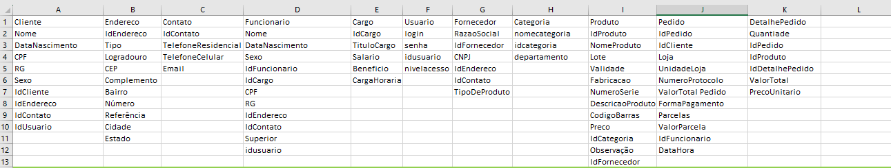
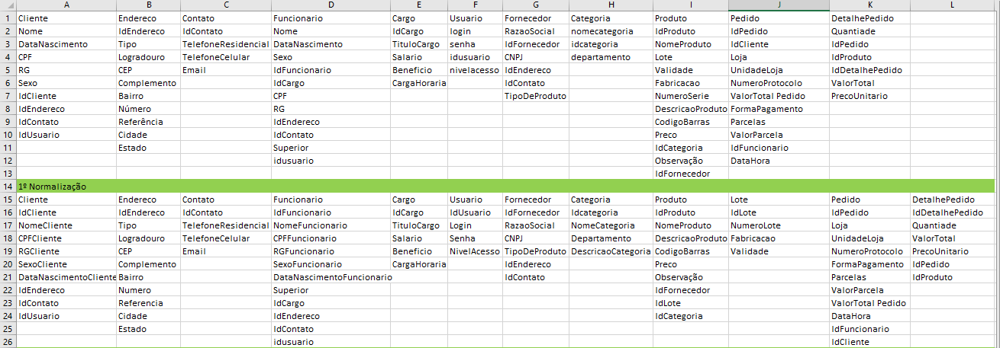
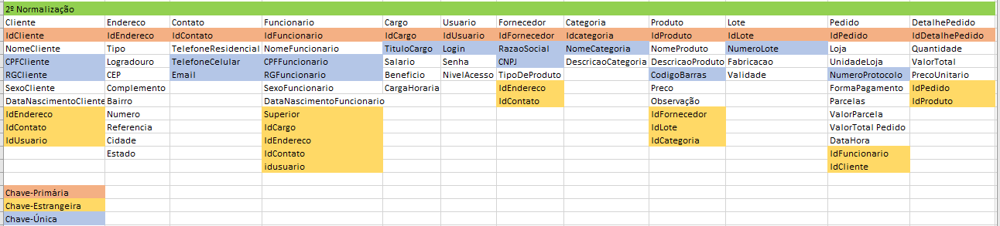
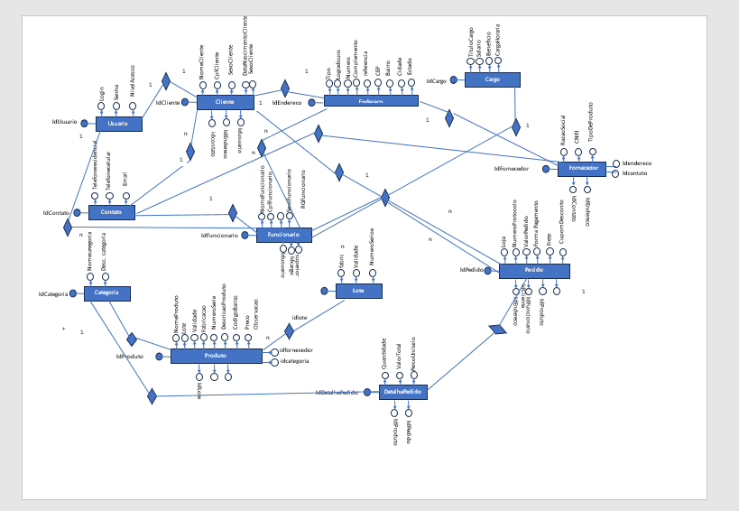

# Modelagem de Dados
## Banco de Dados PaperBook

Segue as tabelas
Cliente; Endereço; Contato; Categoria; Fornecedor; Produto; Pedido; Detalhes do Pedido;

<hr>

No projeto de banco de dados, normalmente são considerados dois níveis de abstração de modelo de dados, o do modelo conceitual e o do modelo lógico.
Além dos dois citados acima, também temos o modelo físico com a usa implementação.

### Níveis de Modelagem - Modelo de dados conceitual 

Este é o modelo de “quadro geral” que representa a estrutura geral e o conteúdo, mas não os detalhes do plano de dados. É o ponto de partida típico para modelagem de dados, identificando os vários conjuntos de dados e fluxo de dados através da organização. O modelo conceitual é o projeto de alto nível para o desenvolvimento dos modelos lógico e físico e é uma parte importante da documentação da arquitetura de dados.

#### Modelagem Conceitual no Excel


#### Modelagem Conceitual no Excel - 1ª Normalização


#### Modelagem Conceitual no Excel - 2ª Normalização


### Modelagem de Dados com o Diagrama de Entidade Relacional
#### Neste diagrama temos as Cardenalidades
    - Um para Um
    - Um para Muitos


```sql
-- MySQL Script generated by MySQL Workbench
-- Tue Jun 27 16:33:42 2023
-- Model: New Model    Version: 1.0
-- MySQL Workbench Forward Engineering

SET @OLD_UNIQUE_CHECKS=@@UNIQUE_CHECKS, UNIQUE_CHECKS=0;
SET @OLD_FOREIGN_KEY_CHECKS=@@FOREIGN_KEY_CHECKS, FOREIGN_KEY_CHECKS=0;
SET @OLD_SQL_MODE=@@SQL_MODE, SQL_MODE='ONLY_FULL_GROUP_BY,STRICT_TRANS_TABLES,NO_ZERO_IN_DATE,NO_ZERO_DATE,ERROR_FOR_DIVISION_BY_ZERO,NO_ENGINE_SUBSTITUTION';

-- -----------------------------------------------------
-- Schema mydb
-- -----------------------------------------------------

-- -----------------------------------------------------
-- Schema mydb
-- -----------------------------------------------------
CREATE SCHEMA IF NOT EXISTS `mydb` DEFAULT CHARACTER SET utf8 ;
USE `mydb` ;

-- -----------------------------------------------------
-- Table `mydb`.`Usuario`
-- -----------------------------------------------------
CREATE TABLE IF NOT EXISTS `mydb`.`Usuario` (
  `idusuario` INT NOT NULL AUTO_INCREMENT,
  `login` VARCHAR(20) NOT NULL,
  `senha` VARCHAR(255) NOT NULL,
  `nivelacesso` VARCHAR(45) CHARACTER SET 'utf8mb4' COLLATE 'utf8mb4_general_ci' NOT NULL,
  PRIMARY KEY (`idusuario`),
  UNIQUE INDEX `login_UNIQUE` (`login` ASC) )
ENGINE = InnoDB;


-- -----------------------------------------------------
-- Table `mydb`.`Contato`
-- -----------------------------------------------------
CREATE TABLE IF NOT EXISTS `mydb`.`Contato` (
  `idcontato` INT NOT NULL AUTO_INCREMENT,
  `telefonecelular` VARCHAR(20) NULL,
  `telefoneresidencial` VARCHAR(20) NULL,
  `email` VARCHAR(50) NULL,
  PRIMARY KEY (`idcontato`),
  UNIQUE INDEX `telefonecelular_UNIQUE` (`telefonecelular` ASC) ,
  UNIQUE INDEX `email_UNIQUE` (`email` ASC) )
ENGINE = InnoDB;


-- -----------------------------------------------------
-- Table `mydb`.`Endereco`
-- -----------------------------------------------------
CREATE TABLE IF NOT EXISTS `mydb`.`Endereco` (
  `idendereco` INT NOT NULL AUTO_INCREMENT,
  `tipo` VARCHAR(20) NOT NULL,
  `logradouro` VARCHAR(50) NOT NULL,
  `numero` VARCHAR(10) NOT NULL,
  `complemento` VARCHAR(45) NULL,
  `cep` VARCHAR(10) NOT NULL,
  `referencia` VARCHAR(50) NULL,
  `bairro` VARCHAR(45) NOT NULL,
  `cidade` VARCHAR(45) NOT NULL,
  `estado` VARCHAR(45) NOT NULL,
  PRIMARY KEY (`idendereco`))
ENGINE = InnoDB;


-- -----------------------------------------------------
-- Table `mydb`.`Cliente`
-- -----------------------------------------------------
CREATE TABLE IF NOT EXISTS `mydb`.`Cliente` (
  `idcliente` INT NOT NULL AUTO_INCREMENT,
  `nomecliente` VARCHAR(50) NOT NULL,
  `cpf` VARCHAR(15) NOT NULL,
  `rgcliente` VARCHAR(20) NOT NULL,
  `sexocliente` ENUM("Masculino", "Feminino") NOT NULL,
  `datanascimento` DATE NOT NULL,
  `idendereco` INT NOT NULL,
  `idcontato` INT NOT NULL,
  `idusuario` INT NOT NULL,
  PRIMARY KEY (`idcliente`),
  UNIQUE INDEX `cpf_UNIQUE` (`cpf` ASC) ,
  UNIQUE INDEX `rgcliente_UNIQUE` (`rgcliente` ASC) ,
  INDEX `fk_cliente_pk_contato_idx` (`idcontato` ASC) ,
  INDEX `fk_cliente_pk_endereco_idx` (`idendereco` ASC) ,
  INDEX `fk_cliente_pk_usuario_idx` (`idusuario` ASC) ,
  CONSTRAINT `fk_cliente_pk_contato`
    FOREIGN KEY (`idcontato`)
    REFERENCES `mydb`.`Contato` (`idcontato`)
    ON DELETE NO ACTION
    ON UPDATE NO ACTION,
  CONSTRAINT `fk_cliente_pk_endereco`
    FOREIGN KEY (`idendereco`)
    REFERENCES `mydb`.`Endereco` (`idendereco`)
    ON DELETE NO ACTION
    ON UPDATE NO ACTION,
  CONSTRAINT `fk_cliente_pk_usuario`
    FOREIGN KEY (`idusuario`)
    REFERENCES `mydb`.`Usuario` (`idusuario`)
    ON DELETE NO ACTION
    ON UPDATE NO ACTION)
ENGINE = InnoDB;


-- -----------------------------------------------------
-- Table `mydb`.`Cargo`
-- -----------------------------------------------------
CREATE TABLE IF NOT EXISTS `mydb`.`Cargo` (
  `idcargo` INT NOT NULL AUTO_INCREMENT,
  `titulocargo` VARCHAR(25) NOT NULL,
  `salario` DECIMAL(7,2) NOT NULL,
  `beneficio` VARCHAR(20) NOT NULL,
  `cargahoraria` VARCHAR(45) NOT NULL,
  PRIMARY KEY (`idcargo`),
  UNIQUE INDEX `nomecategoria_UNIQUE` (`titulocargo` ASC) )
ENGINE = InnoDB;


-- -----------------------------------------------------
-- Table `mydb`.`Funcionario`
-- -----------------------------------------------------
CREATE TABLE IF NOT EXISTS `mydb`.`Funcionario` (
  `idfuncionario` INT NOT NULL AUTO_INCREMENT,
  `nomefuncionario` VARCHAR(45) NOT NULL,
  `cpffuncionario` VARCHAR(20) NOT NULL,
  `rgfuncionario` VARCHAR(25) NOT NULL,
  `sexofuncionario` ENUM("Masculino", "Feminino") NOT NULL,
  `datadenascimentofuncionario` DATE NOT NULL,
  `superior` INT NOT NULL,
  `idcargo` INT NOT NULL,
  `idendereco` INT NOT NULL,
  `idcontato` INT NOT NULL,
  `idusuario` INT NOT NULL,
  PRIMARY KEY (`idfuncionario`),
  UNIQUE INDEX `cpffuncionario_UNIQUE` (`cpffuncionario` ASC) ,
  UNIQUE INDEX `rgfuncionario_UNIQUE` (`rgfuncionario` ASC) ,
  INDEX `fk_funcionario_pk_funcionario_idx` (`superior` ASC) ,
  INDEX `fk_funcionario_pk_cargo_idx` (`idcargo` ASC) ,
  INDEX `fk_funcionario_pk_endereco_idx` (`idendereco` ASC) ,
  INDEX `fk_funcionario_pk_contato_idx` (`idcontato` ASC) ,
  INDEX `fk_funcionario_pk_usuario_idx` (`idusuario` ASC) ,
  CONSTRAINT `fk_funcionario_pk_funcionario`
    FOREIGN KEY (`superior`)
    REFERENCES `mydb`.`Funcionario` (`idfuncionario`)
    ON DELETE NO ACTION
    ON UPDATE NO ACTION,
  CONSTRAINT `fk_funcionario_pk_cargo`
    FOREIGN KEY (`idcargo`)
    REFERENCES `mydb`.`Cargo` (`idcargo`)
    ON DELETE NO ACTION
    ON UPDATE NO ACTION,
  CONSTRAINT `fk_funcionario_pk_endereco`
    FOREIGN KEY (`idendereco`)
    REFERENCES `mydb`.`Endereco` (`idendereco`)
    ON DELETE NO ACTION
    ON UPDATE NO ACTION,
  CONSTRAINT `fk_funcionario_pk_contato`
    FOREIGN KEY (`idcontato`)
    REFERENCES `mydb`.`Contato` (`idcontato`)
    ON DELETE NO ACTION
    ON UPDATE NO ACTION,
  CONSTRAINT `fk_funcionario_pk_usuario`
    FOREIGN KEY (`idusuario`)
    REFERENCES `mydb`.`Usuario` (`idusuario`)
    ON DELETE NO ACTION
    ON UPDATE NO ACTION)
ENGINE = InnoDB;


-- -----------------------------------------------------
-- Table `mydb`.`Categoria`
-- -----------------------------------------------------
CREATE TABLE IF NOT EXISTS `mydb`.`Categoria` (
  `idcategoria` INT NOT NULL AUTO_INCREMENT,
  `nomecategoria` VARCHAR(25) NOT NULL,
  `descricaocategoria` VARCHAR(35) NOT NULL,
  PRIMARY KEY (`idcategoria`))
ENGINE = InnoDB;


-- -----------------------------------------------------
-- Table `mydb`.`Lote`
-- -----------------------------------------------------
CREATE TABLE IF NOT EXISTS `mydb`.`Lote` (
  `idlote` INT NOT NULL AUTO_INCREMENT,
  `numerolote` VARCHAR(10) NOT NULL,
  `fabricacao` VARCHAR(10) NOT NULL,
  `validade` VARCHAR(10) NOT NULL,
  PRIMARY KEY (`idlote`),
  UNIQUE INDEX `numerolote_UNIQUE` (`numerolote` ASC) )
ENGINE = InnoDB;


-- -----------------------------------------------------
-- Table `mydb`.`Fornecedor`
-- -----------------------------------------------------
CREATE TABLE IF NOT EXISTS `mydb`.`Fornecedor` (
  `idfornecedor` INT NOT NULL AUTO_INCREMENT,
  `razaosocial` VARCHAR(25) NOT NULL,
  `cnpj` VARCHAR(15) NOT NULL,
  `tipodeproduto` VARCHAR(25) NOT NULL,
  `idendereco` INT NOT NULL,
  `idcontato` INT NOT NULL,
  PRIMARY KEY (`idfornecedor`),
  UNIQUE INDEX `razaosocial_UNIQUE` (`razaosocial` ASC) ,
  UNIQUE INDEX `cnpj_UNIQUE` (`cnpj` ASC) ,
  INDEX `fk_fornecedor_pk_endereco_idx` (`idendereco` ASC) ,
  INDEX `fk_fornecedor_pkcontato_idx` (`idcontato` ASC) ,
  CONSTRAINT `fk_fornecedor_pk_endereco`
    FOREIGN KEY (`idendereco`)
    REFERENCES `mydb`.`Endereco` (`idendereco`)
    ON DELETE NO ACTION
    ON UPDATE NO ACTION,
  CONSTRAINT `fk_fornecedor_pkcontato`
    FOREIGN KEY (`idcontato`)
    REFERENCES `mydb`.`Contato` (`idcontato`)
    ON DELETE NO ACTION
    ON UPDATE NO ACTION)
ENGINE = InnoDB;


-- -----------------------------------------------------
-- Table `mydb`.`Produto`
-- -----------------------------------------------------
CREATE TABLE IF NOT EXISTS `mydb`.`Produto` (
  `idproduto` INT NOT NULL AUTO_INCREMENT,
  `nomeproduto` VARCHAR(30) NOT NULL,
  `descricaoproduto` VARCHAR(45) NULL,
  `codigobarras` VARCHAR(15) NOT NULL,
  `preco` VARCHAR(10) NOT NULL,
  `observacao` VARCHAR(20) NULL,
  `idfornecedor` INT NOT NULL,
  `idlote` INT NOT NULL,
  `idcategoria` INT NOT NULL,
  PRIMARY KEY (`idproduto`),
  UNIQUE INDEX `codigobarras_UNIQUE` (`codigobarras` ASC) ,
  INDEX `fk_produto_pk_fornecedor_idx` (`idfornecedor` ASC) ,
  INDEX `fk_produto_pk_lote_idx` (`idlote` ASC) ,
  INDEX `fk_produto_pk_categoria_idx` (`idcategoria` ASC) ,
  CONSTRAINT `fk_produto_pk_fornecedor`
    FOREIGN KEY (`idfornecedor`)
    REFERENCES `mydb`.`Fornecedor` (`idfornecedor`)
    ON DELETE NO ACTION
    ON UPDATE NO ACTION,
  CONSTRAINT `fk_produto_pk_lote`
    FOREIGN KEY (`idlote`)
    REFERENCES `mydb`.`Lote` (`idlote`)
    ON DELETE NO ACTION
    ON UPDATE NO ACTION,
  CONSTRAINT `fk_produto_pk_categoria`
    FOREIGN KEY (`idcategoria`)
    REFERENCES `mydb`.`Categoria` (`idcategoria`)
    ON DELETE NO ACTION
    ON UPDATE NO ACTION)
ENGINE = InnoDB;


-- -----------------------------------------------------
-- Table `mydb`.`Pedido`
-- -----------------------------------------------------
CREATE TABLE IF NOT EXISTS `mydb`.`Pedido` (
  `idpedido` INT NOT NULL AUTO_INCREMENT,
  `loja` VARCHAR(25) NOT NULL,
  `unidadeloja` VARCHAR(30) NULL,
  `numeroprotocolo` VARCHAR(25) NOT NULL,
  `formadepagamento` VARCHAR(20) NOT NULL,
  `parcelas` DECIMAL(7,2) NOT NULL,
  `valorparcela` DECIMAL(7,2) NOT NULL,
  `valortotaldopedido` DECIMAL(7,2) NOT NULL,
  `datahora` DATETIME(10) NOT NULL,
  `idfuncionario` INT NOT NULL,
  `idcliente` INT NOT NULL,
  PRIMARY KEY (`idpedido`),
  UNIQUE INDEX `numeroprotocolo_UNIQUE` (`numeroprotocolo` ASC) ,
  INDEX `fk_pedido_pk_funcionario_idx` (`idfuncionario` ASC) ,
  INDEX `fk_pedido_pk_cliente_idx` (`idcliente` ASC) ,
  CONSTRAINT `fk_pedido_pk_funcionario`
    FOREIGN KEY (`idfuncionario`)
    REFERENCES `mydb`.`Funcionario` (`idfuncionario`)
    ON DELETE NO ACTION
    ON UPDATE NO ACTION,
  CONSTRAINT `fk_pedido_pk_cliente`
    FOREIGN KEY (`idcliente`)
    REFERENCES `mydb`.`Cliente` (`idcliente`)
    ON DELETE NO ACTION
    ON UPDATE NO ACTION)
ENGINE = InnoDB;


-- -----------------------------------------------------
-- Table `mydb`.`DetalhePedido`
-- -----------------------------------------------------
CREATE TABLE IF NOT EXISTS `mydb`.`DetalhePedido` (
  `iddetalhepedido` INT NOT NULL AUTO_INCREMENT,
  `quantidade` VARCHAR(20) NOT NULL,
  `valortotal` DECIMAL(7,2) NOT NULL,
  `precounitario` DECIMAL(7,2) NOT NULL,
  `idpedido` INT NOT NULL,
  `idproduto` INT NOT NULL,
  PRIMARY KEY (`iddetalhepedido`),
  INDEX `fk_detalhepedido_pk_pedido_idx` (`idpedido` ASC) ,
  INDEX `fk_detalhepedido_pk_produto_idx` (`idproduto` ASC) ,
  CONSTRAINT `fk_detalhepedido_pk_pedido`
    FOREIGN KEY (`idpedido`)
    REFERENCES `mydb`.`Pedido` (`idpedido`)
    ON DELETE NO ACTION
    ON UPDATE NO ACTION,
  CONSTRAINT `fk_detalhepedido_pk_produto`
    FOREIGN KEY (`idproduto`)
    REFERENCES `mydb`.`Produto` (`idproduto`)
    ON DELETE NO ACTION
    ON UPDATE NO ACTION)
ENGINE = InnoDB;


SET SQL_MODE=@OLD_SQL_MODE;
SET FOREIGN_KEY_CHECKS=@OLD_FOREIGN_KEY_CHECKS;
SET UNIQUE_CHECKS=@OLD_UNIQUE_CHECKS;
```